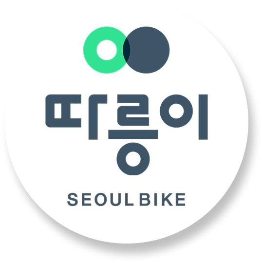
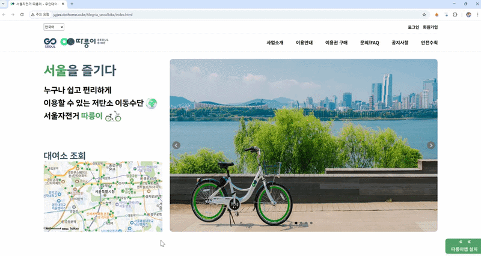
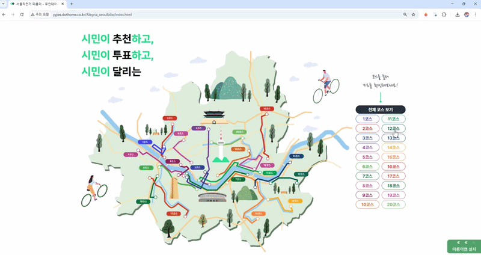
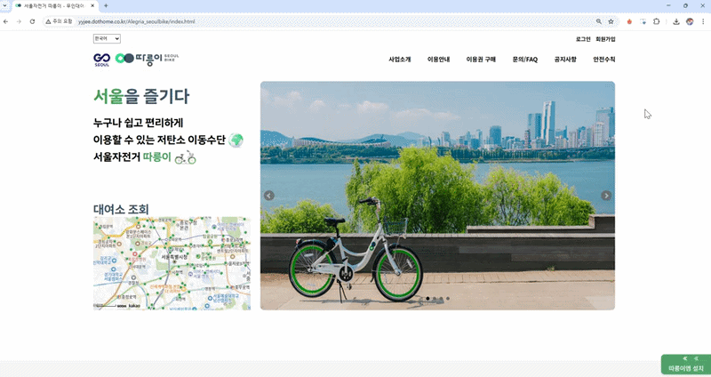
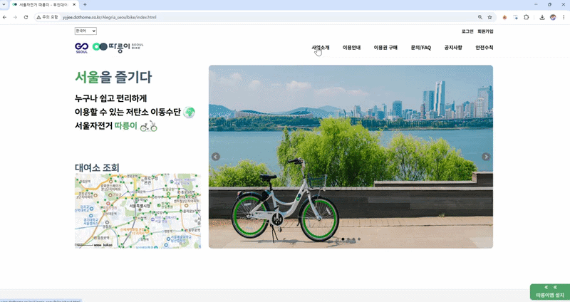

<!-- 로고 이미지 -->

  

<!-- 링크 버튼 -->

  
  
  

<!-- 프로젝트 기본 정보 -->
<h3 align="center">
  서울시 공공자전거 ‘따릉이’ 웹사이트를 분석하여  
  메인 화면 구조를 개선하고 사용자 경험(UX) 중심의 서비스 페이지를 구현한 프로젝트입니다.
</h3>

<h4 align="center">
  [ Front-end Team Project | 5 Members | Jun 16 – Jun 27, 2025 ]
</h4>
 

<!-- 내용 -->
## 🛠 Tech Stack

  
  
  
  
  

  
  
  

  
  
  

## ✨ Key Features

**📍 지도 기반 대여소 탐색**
- `Kakao Maps API`를 활용하여 서울시 공공자전거 대여소 위치를 지도에 표시
- 대여소 위치를 직관적으로 확인할 수 있도록 커스텀 마커 적용

**🧭 사용자 중심 메인 화면 구조**
- 기존 따릉이 사이트를 분석하여 사용자가 가장 많이 사용하는  
  '대여소 찾기' 기능을 메인 화면 중심에 배치

**🎞 인터랙션 기반 UI 요소**
- `bxSlider`를 활용한 메인 배너 슬라이더 구현
- 앱 설치 유도 배너 및 Hover 인터랙션 적용

**🎨 서비스 아이덴티티 시각화**
- 서비스 분위기에 맞는 배너 및 그래픽 요소 직접 제작
- 전체 UI의 시각적 일관성 유지

## 🖥️ Project Preview

> 본 프로젝트는 서울시 공공자전거 서비스 ‘따릉이’ 공식 웹사이트를 분석하여  
메인 화면의 정보 구조와 사용자 흐름을 개선하는 것을 목표로 진행되었습니다.

| 메인 페이지 (지도 & 슬라이더) | 인터랙션 및 배너 |
| :---: | :---: |
|  |  |
| **서브 : 로그인/회원가입** | **서브 : 서비스 안내 및 공지사항** |
|  |  |

## 👤 My Role & Contributions
프로젝트 기획부터 UI 설계, 지도 기능 구현, 최종 발표까지 프로젝트 전 과정에 참여했습니다.

**1. 기획 및 UI/UX 설계**  
- `Figma`를 활용해 프로젝트 기획서와 UI 시안을 제작하고 팀원들과 디자인 가이드 공유  
- 기존 사이트 분석 후 핵심 기능인 **대여소 찾기 기능을 메인 화면 중심 구조로 재설계**

**2. 지도 기능 구현 (Kakao Maps API)**  
- `Kakao Maps API`를 연동하여 메인 페이지 대여소 지도 기능 구현  
- 기본 마커 대신 **커스텀 원형 마커**를 적용해 대여소 위치 가독성 개선

**3. 그래픽 자산 제작 및 UI 구현**  
- `bxSlider`를 활용한 이미지 슬라이더 및 앱 설치 유도 호버 배너 구현  
- 하단 배너 및 서비스 UI 그래픽 요소를 직접 제작하여 전체 디자인 완성도 향상

**4. 프로젝트 최종 발표**  
- 프로젝트 기획 의도와 구현 결과를 정리하여 **팀 대표로 최종 발표 진행**

## 🚀 Problem Solving

#### 🔍 API 연동 과정에서의 시각적 구현 
- **상황**: `Kakao Maps API`의 기본 핀 마커가 서비스 디자인 톤과 맞지 않는 문제가 있었습니다.
- **해결**: `HTML(DOM)`기반 커스텀 마커를 생성해 브랜드 컬러의 원형 마커로 구현했습니다.
- **성과**: `JavaScript`와 `CSS`를 활용해 지도 마커를 프로젝트 디자인에 맞게 직접 커스터마이징했습니다.

#### 🤝 협업을 위한 코드 및 파일 관리
- **상황**: 팀 프로젝트 진행 중 파일명과 코드 스타일이 혼재될 가능성이 있었습니다.
- **해결**: 파일명 Naming Convention을 정의해 팀원들과 일관된 코드 관리 기준을 유지했습니다.
- **성과**: 파일 관리 혼선을 줄이고 협업 과정에서 코드 가독성과 유지보수성을 높일 수 있었습니다.

## 🌱 Retrospective & Growth

#### ✔ 데이터 기반 UI 설계 경험
사용자가 가장 먼저 수행하는 핵심 행동인 대여소 위치 확인에 집중하여 메인 페이지를 지도 중심 구조로 재설계했습니다.  
이 과정을 통해 사용자의 핵심 과업을 빠르게 해결하는 UI 설계의 중요성을 경험했습니다.

#### ✔ API 커스터마이징 경험
Kakao Maps API의 기본 마커 대신 DOM 기반 커스텀 마커를 구현하며  
라이브러리의 기본 기능에 의존하지 않고 프로젝트 요구사항에 맞게 UI를 확장하는 방법을 배웠습니다.

#### ✔ 디자인과 개발을 연결하는 경험
Figma 시안을 직접 제작하고 구현하면서 Color System, Spacing 등 디자인 가이드의 필요성을 체감했습니다.  
이 경험을 통해 이후 프로젝트에서는 디자인 시스템을 기반으로 한 구조적인 UI 개발을 목표로 하고 있습니다.

#### ✔ 앞으로의 발전 방향
향후에는 공공데이터 실시간 API(대여 가능 수량 등)를 연동하여  
데이터 변화에 따라 UI가 즉각 반응하는 동적 인터페이스 구현에 도전하고 싶습니다.

  

